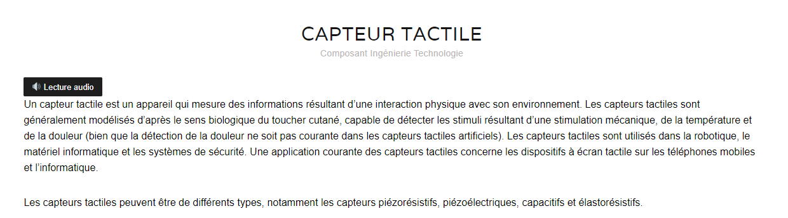
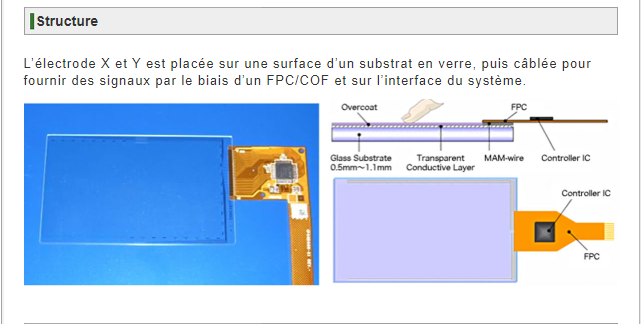
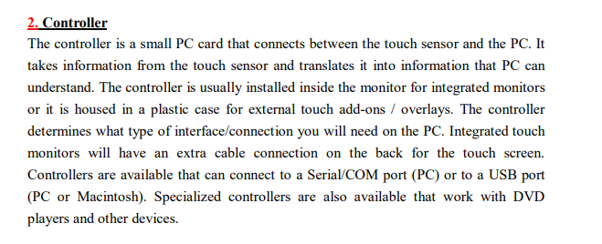
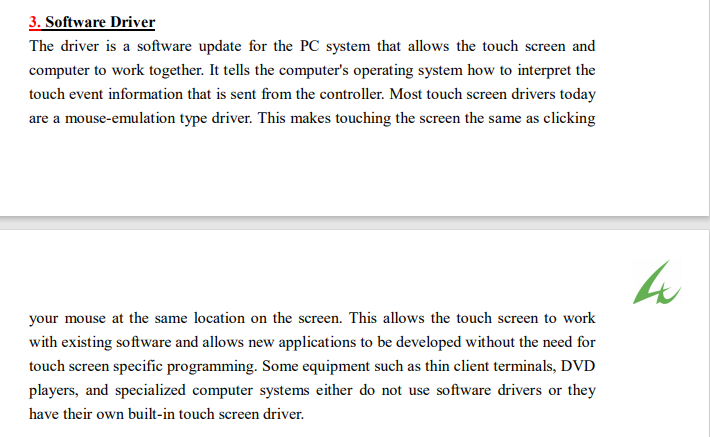

# Composants

#### Cette section présente brièvement les composants d'un écran tactile. Les documents y sont classés par ordre alphabétique d'auteur ou en fonction du nom du site.

### Un écran tactile possède 

### - un capteur

#### ARCHIVOR. *Capteur tactile*. Dans : HiSoUR Art Culture Histoire [en ligne]. 2018. [Consulté le 23 août 2020]. Disponible à l’adresse : [https://www.hisour.com/fr/tactile-sensor-42878/.](https://www.hisour.com/fr/tactile-sensor-42878/.)

#### FUTABA CORPORATION. *Touch panel*. Dans : Futaba Corporation [en ligne]. 2008. [Consulté le 23 août 2020]. Disponible à l’adresse : https://www.futaba.co.jp/en/display/tp/index.html.
 

### - un controleur 

#### Construction of touch screen set (12.1 - GT).pdf [en ligne]. [Consulté le 23 août 2020]. Disponible à l’adresse : http://www.4ugmbh.de/Manuals/SAW%20TOUCH%20SCREEN%20(12.1%20-%20GT).pdf

### - un pilote de logiciel

#### Construction of touch screen set (12.1 - GT).pdf [en ligne]. [Consulté le 23 août 2020]. Disponible à l’adresse : [http://www.4ugmbh.de/Manuals/SAW%20TOUCH%20SCREEN%20(12.1%20-%20GT).pdf](http://www.4ugmbh.de/Manuals/SAW%20TOUCH%20SCREEN%20(12.1%20-%20GT).pdf)

### Sources utilisées

### [Archivor](https://www.hisour.com/fr/tactile-sensor-42878/.)

### [Construction of touch screen set](http://www.4ugmbh.de/Manuals/SAW%20TOUCH%20SCREEN%20(12.1%20-%20GT).pdf)

### [Futuba](https://www.futaba.co.jp/en/display/tp/index.html.)

### Suite du dossier documentaire à la page [Ecrans tactiles dans les bibliothèques](ecranstactilesbibliotheques.md) 

### [Page d'accueil](Pagedaccueil.md)
