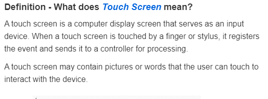
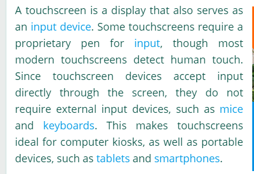
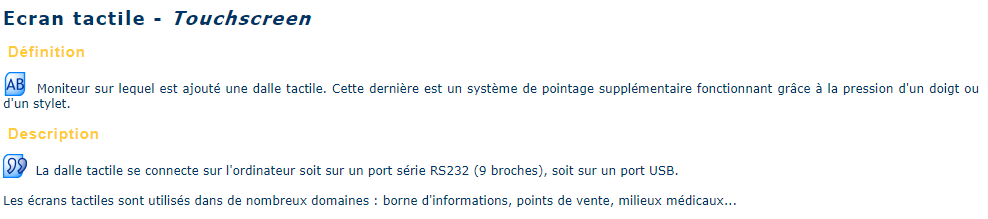
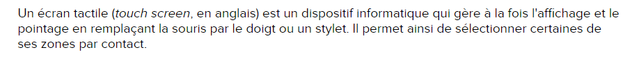

# Definition 

Cette page a pour objectif définir les écrans tactiles, en anglais et en français, et de présenter les différents types d'écrans tactiles existant.

### Les différentes définitions en anglais 

## TECHOPEDIA. *What is a Touch Screen? - Definition from Techopedia*. Dans : Techopedia [en ligne]. 2017. [Consulté le 10 août 2020]. Disponible à l’adresse :                 [https://www.techopedia.com/definition/3055/touch-screen](https://www.techopedia.com/definition/3055/touch-screen)

### TECH TERMS. *Touchscreen Definition*. Dans : TechTerms [en ligne]. 2020. [Consulté le 23 août 2020]. Disponible à l’adresse : [https://techterms.com/definition/touchscreen](https://techterms.com/definition/touchscreen) 

### Les différentes définitions en français

### DICO DU NET. *Ecran tactile - Définition de Ecran tactile (Touchscreen)*. Dans : Dico du net [en ligne]. [s. d.]. [Consulté le 4 août 2020]. Disponible à l’adresse : [http://www.dicodunet.com/definitions/materiel/ecran-tactile.htm](http://www.dicodunet.com/definitions/materiel/ecran-tactile.htm)

### FUTURA-SCIENCES. *Écran tactile*. Dans : Futura [en ligne]. 2020. [Consulté le 28 août 2020]. Disponible à l’adresse : https://www.futura-sciences.com/tech/definitions/technologie-ecran-tactile-539/

## Liens des sources utlisées pour cette section :

#### [Dico net](http://www.dicodunet.com/definitions/materiel/ecran-tactile.htm)

#### [Futura Tech](https://www.futura-sciences.com/tech/definitions/technologie-ecran-tactile-539/) 

#### [Techopedia](https://www.techopedia.com/definition/3055/touch-screen)

#### [Tech term](https://techterms.com/definition/touchscreen)

#### Le dossier documentaire continue : rendez-vous à la page [Historique](Historique.md)

#### [Page d'accueil](Pagedaccueil)

