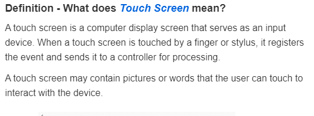

# Definition 

Cette page a pour objectif définir les écrans tactiles, en anglais et en français, et de présenter les différents types d'écrans tactiles existant.

### Les différentes définitions en anglais 

## TECHOPEDIA. *What is a Touch Screen? - Definition from Techopedia*. Dans : Techopedia [en ligne]. 2017. [Consulté le 10 août 2020]. Disponible à l’adresse :                 [https://www.techopedia.com/definition/3055/touch-screen](https://www.techopedia.com/definition/3055/touch-screen)

### Les différentes définitions en français

 

## Liens des sources utlisées pour cette section :

[Techopedia](https://www.techopedia.com/definition/3055/touch-screen)

[Futura Tech](https://www.futura-sciences.com/tech/definitions/technologie-ecran-tactile-539/) 

[Les technologies tactiles](http://www-igm.univ-mlv.fr/~dr/XPOSE2008/Les%20technologies%20tactiles/histo_origine.html)

#### Le dossier documentaire continue : rendez-vous à la page [Historique](Historique.md)

#### [Page d'accueil](Pagedaccueil)

