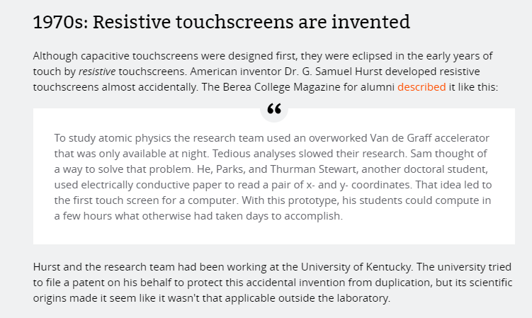
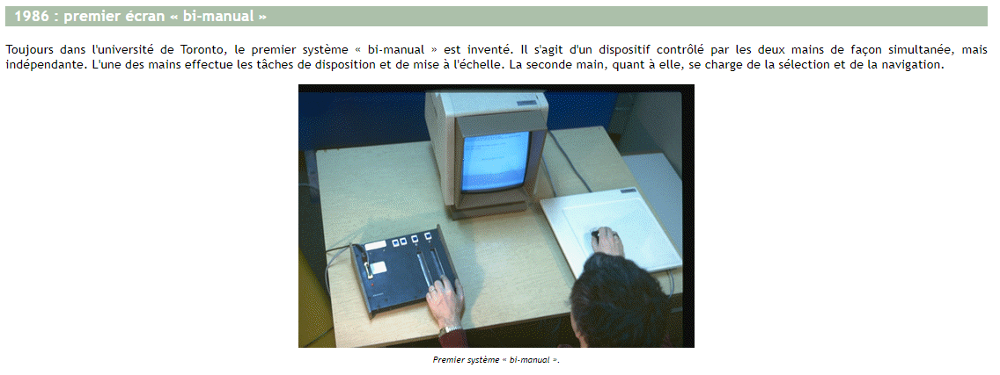
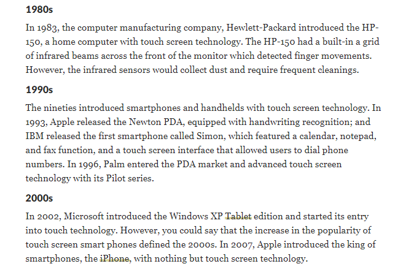
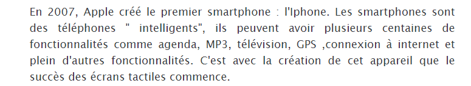

# Historique des écrans tactiles

### Cette section retrace l'histoire de l'écran tactile, de son invention à sa commercialisation par Apple ou d'autres. Une ligne du temps illustre cette histoire.

#### Plato IV, un programme pour l'éduction.

### CIGREF. *Histoire des premiers écrans aux écrans tactiles*. Dans : Histoire-cigref.org [en ligne]. 2012. [Consulté le 4 août 2020]. Disponible à l’adresse : [https://www.cigref.fr/archives/histoire-cigref/blog/histoire-des-premiers-ecrans-aux-ecrans-tactiles/](https://www.cigref.fr/archives/histoire-cigref/blog/histoire-des-premiers-ecrans-aux-ecrans-tactiles/)

#### La ligne du temps

### ION, Florence. From touch displays to the Surface: A brief history of touchscreen technology. Dans : Ars Technica [en ligne]. 2013. [Consulté le 10 août 2020]. Disponible à l’adresse : [https://arstechnica.com/gadgets/2013/04/from-touch-displays-to-the-surface-a-brief-history-of-touchscreen-technology/](https://arstechnica.com/gadgets/2013/04/from-touch-displays-to-the-surface-a-brief-history-of-touchscreen-technology/)

### Sam Hurst, inventeur de l'écran tactile0

### ION, Florence. From touch displays to the Surface: A brief history of touchscreen technology. Dans : Ars Technica [en ligne]. 2013. [Consulté le 10 août 2020]. Disponible à l’adresse : [https://arstechnica.com/gadgets/2013/04/from-touch-displays-to-the-surface-a-brief-history-of-touchscreen-technology/](https://arstechnica.com/gadgets/2013/04/from-touch-displays-to-the-surface-a-brief-history-of-touchscreen-technology/)

### Les technologies tactiles. *Historique - L’origine des temps* [en ligne]. [s. d.]. [Consulté le 30 avril 2020]. Disponible à l’adresse : [http://igm.univ-mlv.fr/~dr/XPOSE2008/Les%20technologies%20tactiles/histo_origine.html](http://igm.univ-mlv.fr/~dr/XPOSE2008/Les%20technologies%20tactiles/histo_origine.html)

### BELLIS, Mary et Graham, BELL. *What’s the History of Touch Screen Technology?*. Dans : ThoughtCo [en ligne]. [s. d.]. [Consulté le 10 août 2020]. Disponible à l’adresse : [https://www.thoughtco.com/who-invented-touch-screen-technology-1992535](https://www.thoughtco.com/who-invented-touch-screen-technology-1992535)

### FERREIRA GUILLAUME. *Historique*. Dans : WIKEO.NET,tpe ecran tactile. [en ligne]. [s. d.]. [Consulté le 25 août 2020]. Disponible à l’adresse : [https://tpe-ecrans-tactiles.wikeo.fr/historique.html](https://tpe-ecrans-tactiles.wikeo.fr/historique.html) 

Page suivante [typestouchscren](typestouchscreen.md)

[Page d'accueil](Pagedaccueil.md)
