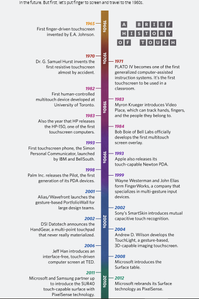

# Historique des écrans tactiles

#### ION, Florence. From touch displays to the Surface: A brief history of touchscreen technology. Dans : Ars Technica [en ligne]. 2013. [Consulté le 10 août 2020]. Disponible à l’adresse : [https://arstechnica.com/gadgets/2013/04/from-touch-displays-to-the-surface-a-brief-history-of-touchscreen-technology/](https://arstechnica.com/gadgets/2013/04/from-touch-displays-to-the-surface-a-brief-history-of-touchscreen-technology/)

#### ION, Florence. From touch displays to the Surface: A brief history of touchscreen technology. Dans : Ars Technica [en ligne]. 2013. [Consulté le 10 août 2020]. Disponible à l’adresse : [https://arstechnica.com/gadgets/2013/04/from-touch-displays-to-the-surface-a-brief-history-of-touchscreen-technology/](https://arstechnica.com/gadgets/2013/04/from-touch-displays-to-the-surface-a-brief-history-of-touchscreen-technology/)

Page suivante [typestouchscren](typestouchscreen.md)

[Page d'accueil](Pagedaccueil.md)
