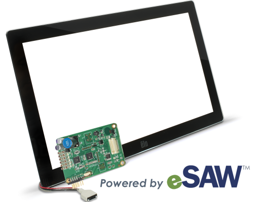

#  Introduction 

Les écrans tacliles ont pris une grande place dans nos vies. En effet, nous nous sommes habitués à avoir un gsm tactile, un GPS, une tablette ou encore un ordinateur avec écran tactile. Mais connaissons-nous son histoire, ses avantages et inconvénients, son fonctionnement, ses composants et sa place dans les bibliothèques ? Ce dossier documentaire a pour objectif de répondre à toutes ces interrogations.

Après lectures des différents documents trouvés, j'ai établi un plan de classement se structurant de la manière suivante :

###  [Definition](Definition.md)

Dans cette section, vous pourrez découvrir quelques définitions d'écrans tactiles et les différents d'écrans tactiles qu'il existe ainsi que leurs définitions. Les sources de cette section sont classées par ordre alphabétique.

### [Historique](historique.md)

Cette section retrace l'histoire de l'éran tactile.

### [typestouchscren](typestouchscreen.md)

Présentation des différents types d'écrans tactiles.

### [Composants](Composants.md)

Cette section décrit les composants d'un écran tactile.

### [Ecrans tactiles dans les bibliothèques](ecranstactilesbibliotheques.md) 

Cette section présente l'utilité des écrans tactiles dans les bibliothèques.

### [Bibliographie](Bibliographie) 

Le dossier documentaire s'achèvera par une bibliographie.

© IntelliTouch

#### Je vous invite à vous rendre à la page [Definition](Definition.md) pour poser les bases des orignines des écrans tactiles.

#### Pour retourner à la page d'accueil, c'est par ici : [Page d'accueil](Pagedaccueil.md)
   
