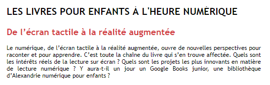

# Les écrans tactiles dans les bibliothèques 

#### Dans cette section vous pourrez découvrir l'utilité qu'ont les écrans tactiles dans les bibliothèques. La numérisation est un enjeu, la digitalisation l'est tout autant dans les bibliothèques.

#### APPRENDRE À APPRENDRE. *Apprend-on mieux sur un support papier ou sur un écran ?*. Dans : apprendreaapprendre.com [en ligne]. 2020. [Consulté le 25 août 2020]. Disponible à l’adresse : [https://www.apprendreaapprendre.com/reussite_scolaire/apprend-on-mieux-sur-un-support-papier-ou-sur-un-ecran/](https://www.apprendreaapprendre.com/reussite_scolaire/apprend-on-mieux-sur-un-support-papier-ou-sur-un-ecran/) 

#### Les tables tactiles sont parfaite pour animées les enfants. Ils peuvent s'évader au coeur d'un livre.

#### LA PETITE BIBLIOTHÈQUE RONDE. De l’écran tactile à la réalité augmentée / Les livres pour enfants à l’heure numérique / Culture, Enfance & Numérique / Dossiers thématiques / Ressources / La Petite Bibliothèque Ronde - La Petite Bibliotheque Ronde. Dans : La petite bibliothèque ronde [en ligne]. 2009. [Consulté le 31 mai 2020]. Disponible à l’adresse : [http://www.lapetitebibliothequeronde.com/Ressources/Dossiers-thematiques/Culture-Enfance-Numerique/Les-livres-pour-enfants-a-l-heure-numerique/De-l-ecran-tactile-a-la-realite-augmentee](http://www.lapetitebibliothequeronde.com/Ressources/Dossiers-thematiques/Culture-Enfance-Numerique/Les-livres-pour-enfants-a-l-heure-numerique/De-l-ecran-tactile-a-la-realite-augmentee)

#### Vous pouvez en savoir plus sur une bibliothèque grâce à des écrans tactiles. 

#### Moodboards Bibliothèques. Dans : Digilor [en ligne]. 2018. [Consulté le 15 juin 2020]. Disponible à l’adresse : [https://www.digilor.fr/moodboards-bibliotheques/](https://www.digilor.fr/moodboards-bibliotheques/)

### Liens des sources utilisées :

[Apprendre à apprendre](https://www.apprendreaapprendre.com/reussite_scolaire/apprend-on-mieux-sur-un-support-papier-ou-sur-un-ecran/)

[Bibliothèque ronde](http://www.lapetitebibliothequeronde.com/Ressources/Dossiers-thematiques/Culture-Enfance-Numerique/Les-livres-pour-enfants-a-l-heure-numerique/De-l-ecran-tactile-a-la-realite-augmentee)

[Digilor](https://www.digilor.fr/moodboards-bibliotheques/) 

### Le dossier documentaire prends fin ici. Je vous invinte à consulter ma [bibliograpphie](bibliographie.md).

### [Page d'accueil](Pagedaccueil.md)
