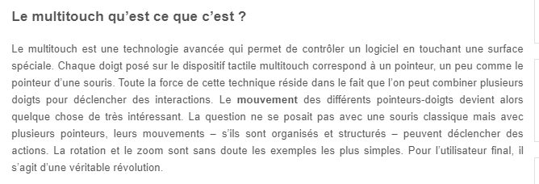
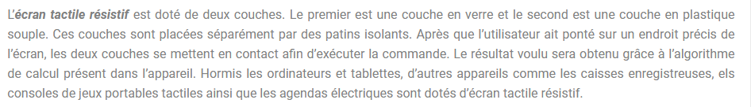
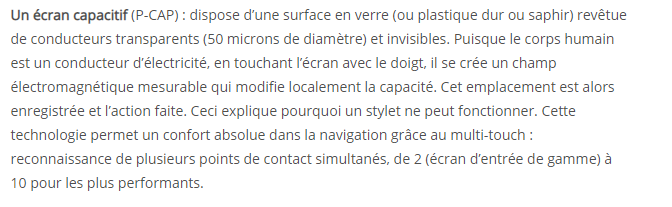

# Les différents types de technologies d'écrans tactiles

Il existe différents écrans tactiles. Cette section vous les présente.

## 1. Ecran tactile Multipoint ou Multitouch

#### DISLAIRE, MAXENCE. *Le MultiTouch qu’est ce que c’est ? A quoi ça sert ? [FAQ]*. Dans : Génération Tactile ... Out Of Home [en ligne]. 2009. [Consulté le 13 août 2020]. Disponible à l’adresse : [http://www.generation-tactile.com/archives-gt/faq/le-multitouch-faq-11829](http://www.generation-tactile.com/archives-gt/faq/le-multitouch-faq-11829)

## 2.  Ecran résistif
                               
#### ECRAN TACTILE. *Informations sur les écrans tactiles résistifs*. [en ligne]. [s. d.]. [Consulté le 13 août 2020]. Disponible à l’adresse : [https://www.ecran-tactile.info/tout-savoir-sur-les-ecrans-tactiles-resistifs-fonctionnement-avantages/](https://www.ecran-tactile.info/tout-savoir-sur-les-ecrans-tactiles-resistifs-fonctionnement-avantages/)

## 3. Ecran capacitif

### MEYER, Raph. *Ecran tactile résistif et capacitif : quelles différences et comment choisir ?*. Dans : Tracabilité code-barre [en ligne]. 2019. [Consulté le 3 août 2020]. Disponible à l’adresse : [https://tracabilite-code-barre.com/quelles-differences-entre-ecran-resistif-et-capacitif/](https://tracabilite-code-barre.com/quelles-differences-entre-ecran-resistif-et-capacitif/)                                

## 4. Ecran infrarouge

### THIERRY. *Ecrans Interactifs Tactiles: comprendre la technologie infrarouge*. Dans : Speechi [en ligne]. [2019]. [Consulté le 13 août 2020]. Disponible à l’adresse : [https://www.speechi.net/fr/2019/02/27/ecran-interactif-tactile-technologie-infrarouge/](https://www.speechi.net/fr/2019/02/27/ecran-interactif-tactile-technologie-infrarouge/)

### Liens des Sources utilisées :

#### [Ecran tactile.info](https://www.ecran-tactile.info/tout-savoir-sur-les-ecrans-tactiles-resistifs-fonctionnement-avantages/)

#### [Génération tactile](http://www.generation-tactile.com/archives-gt/faq/le-multitouch-faq-11829)

#### [SPEECHI](https://www.speechi.net/fr/2019/02/27/ecran-interactif-tactile-technologie-infrarouge/)

#### [Tracabilité](https://tracabilite-code-barre.com/quelles-differences-entre-ecran-resistif-et-capacitif/)

#### Le dossier documentaire continue : rendez-vous à la page [Composants](Composants.md)

#### [Page d'accueil](Pagedaccueil)
